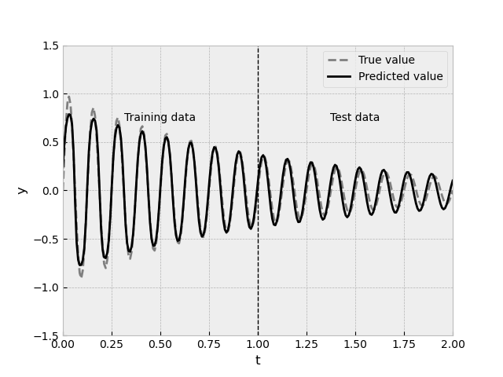

# Long Short-Term Memory Based Recurrent Neural Network

The implementation of the Long Short-Term Memory Based Recurrent Neural Network.

For each element in the sequence, each cell computes

$$i_{t} = \sigma(W_{ii}x_{t} + b_{ii} + W_{hi}h_{t - 1} + b_{hi})$$

$$f_{t} = \sigma(W_{if}x_{t} + b_{if} + W_{hf}h_{t - 1} + b_{hf})$$

$$g_{t} = \tanh(W_{ig}x_{t} + b_{ig} + W_{hg}h_{t - 1} + b_{hg})$$

$$o_{t} = \sigma(W_{io}x_{t} + b_{io} + W_{ho}h_{t - 1} + b_{ho})$$

$$c_{t} = f_{t} \odot c_{t - 1} + i_{t} \odot g_{t}$$

$$h_{t} = o_{t} \odot \tanh(c_{t})$$

where $h_{t}$​ is the hidden state at time $t$, $c_{t}$​ is the cell state at time $t$, $x_{t}$​ is the input at time $t$, $h_{t − 1}$ is the hidden state of the cell at time $t - 1$ or the initial hidden state at time $0$, $i_{t}$​, $f_{t}$​, $g_{t}$​, $o_{t}$​ are the input, forget, cell, and output gates at the time $t$, respectively, $\sigma$ is the sigmoid function and $\odot$ - the Hadamard product.

## Demonstration

Predictions of the two-layer RNN trained to approximate the function $e^{-t}\sin(16\pi t)$ using only its internal state ($x_{t} = 0 \; \forall_{t}$).

## References

[S. Hochreiter, J. Schmidhuber, *Long Short-Term Memory*, Neural Computation, 1997](https://papers.baulab.info/Hochreiter-1997.pdf)