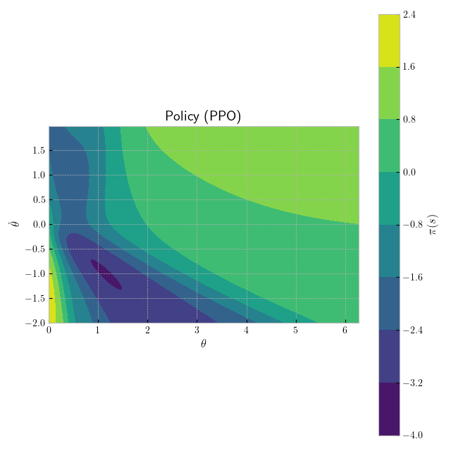
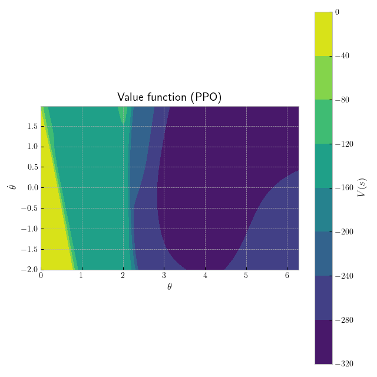
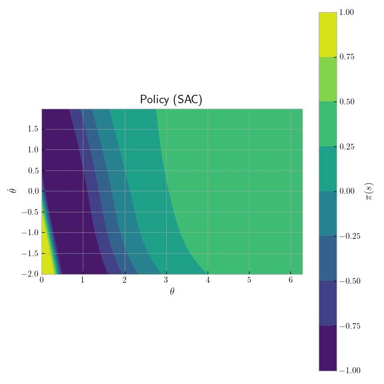
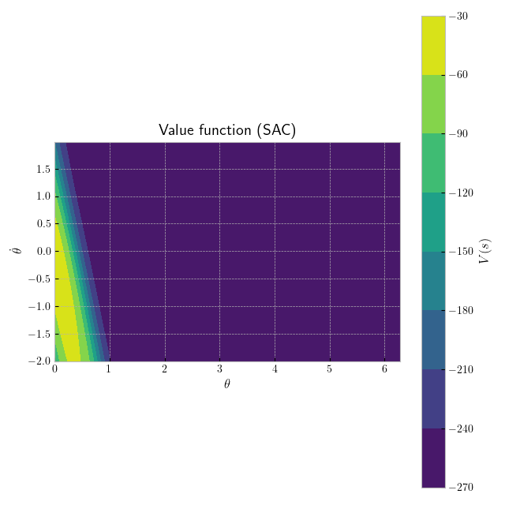

# Reinforcement learning

The implementation of Proximal Policy Optimization and Soft Actor-Critic algorithms.

## Control problem - inverted pendulum

The environment's dynamics are described by the nonlinear differential equation

$$ml^{2}\ddot{\theta} + b\dot{\theta} + mgl\sin{\theta} = u$$

where $m$ is the mass of the pendulum, $l$ is its length, $\theta$ is the pendulum's angle, $b$ is the damping coefficient, $g$ is the gravitational acceleration and $u$ - the control torque.

An environment's state $s$ contains the pendulum's angle $\theta$ and the pendulum's angular velocity $\dot{\theta}$. An action $a$ is clipped and applied as a control torque $u$. A reward signal $r$ equals $-(\theta^2 + 0.1\dot{\theta}^2 + 0.01u^2)$.

The task is to stabilize the pendulum in the unstable upper position ($\theta = 0$).

&nbsp;

## Proximal Policy Optimization

The algorithm optimizes the policy $\pi_{\theta}$ with respect to the objective

$$\max_{\theta} \mathbb{E}_{a_{t} \sim \pi_{\theta}} \left[ \sum_{t} r_{t} \right]$$

through consecutive updates of the policy $\pi_{\theta}$ and the value function $V_{\phi}$.

### Learning algorithm

Input: initial policy parameters $\theta_{1}$, value function parameters $\phi_{1}$

For e in 1, 2, ..., EPOCHS do

&emsp; Collect a set of trajectories $D_{e} = \{\tau_{i}\}$ by running the policy $\pi_{\theta_{e}}$ in the environment

&emsp; Compute rewards-to-go $R_{t}$

$$R_{t} = \sum^{T}_{l = 1} \gamma^{l - 1} r_{t + l - 1}$$

&emsp; Compute advantage estimates $A_{t}$ based on the current value function $V_{\phi_{e}}$

$$A_{t} = \sum^{T}_{t = 1} (\gamma \lambda)^{l - 1}\delta_{t + l - 1}$$

$$\delta_{t} = r_{t} + \gamma V_{\phi_{e}}(s_{t + 1}) - V_{\phi_{e}}(s_{t})$$

&emsp; Update the policy by maximizing the PPO objective

$$\theta_{e + 1} = \arg{\max_{\theta}} \frac{1}{|D_{e}|T} \sum_{\tau \in D_{e}} \sum^{T}_{t = 1} \min \left( \frac{\pi_{\theta}(a_{t}|s_{t})}{\pi_{\theta_{e}}(a_{t}|s_{t})}A_{t}, \operatorname{clip}(\frac{\pi_{\theta}(a_{t}|s_{t})}{\pi_{\theta_{e}}(a_{t}|s_{t})}, 1 - \epsilon, 1 + \epsilon)A_{t} \right)$$

&emsp; via a stochastic gradient ascent

&emsp; Fit the value function

$$\phi_{e + 1} = \arg{\min_{\phi}} \frac{1}{2|D_{e}|T} \sum_{\tau \in D_{e}} \sum^{T}_{t = 1} \left( V_{\phi}(s_{t}) - R_{t} \right) ^2$$

&emsp; via a stochastic gradient descent

### Demonstration

The controller learned with the PPO to stabilize the inverted pendulum.

  

&nbsp;

## Soft Actor-Critic

The algorithm optimizes the $\pi_{\theta}$ policy with respect to the objective

$$\max_{\theta} \mathbb{E}_{a_{t} \sim \pi_{\theta}} \left[ \sum_{t}r_{t} + \alpha\mathcal{H}(\pi(\cdot | s_{t})) \right]$$

through simultaneous training of the policy (actor) $\pi_{\theta}$ and two Q-functions (critics) $Q_{\phi_{1}}$, $Q_{\phi_{2}}$.

### Learning algorithm

Input: initial policy parameters $\theta$, Q-function parameters $\phi_{1}$, $\phi_{2}$, the empty replay buffer $D$

Set target parameters equal to main parameters $\phi_{target, 1} \leftarrow \phi_{1}$, $\phi_{target, 2} \leftarrow \phi_{2}$

Repeat until convergence

&emsp; Observe a state $s$ and select an action $a \sim \pi_{\theta}(\cdot | s)$

&emsp; Execute an $a$ in the environment

&emsp; Observe a next state $s'$, a reward $r$ and a done signal $d$ to indicate whether $s'$ is terminal

&emsp; Store ($s$, $a$, $r$, $s'$, $d$) in the replay buffer $D$

&emsp; If $s'$ is terminal, reset an environment state

&emsp; If it's time to update then

&emsp; &emsp; For u in 1, 2, ..., UPDATES do

&emsp; &emsp; &emsp; Randomly sample a batch of transitions, $B = \{(s, a, r, s', d)\}$ from $D$

&emsp; &emsp; &emsp; Compute targets for Q-functions

$$y(r, s', d) = r + \gamma(1 - d) \left( \min_{i = 1, 2} Q_{\phi_{target, i}}(s', a') - \alpha\log{\pi_{\theta}(a' | s')} \right)$$

$$a' \sim \pi_{\theta}(\cdot | s')$$

&emsp; &emsp; &emsp; Update Q-functions by one step of the gradient descent using

$$\nabla_{\phi_{i}} \frac{1}{|B|} \sum_{(s, a, r, s', d) \in B} \left( Q_{\phi_{i}}(s, a) - y(r, s', d) \right) ^2 \text{ for } i = 1, 2$$

&emsp; &emsp; &emsp; Update the policy by one step of the gradient ascent using

$$\nabla_{\theta} \frac{1}{|B|} \sum_{s \in B} \left( \min_{i = 1, 2} Q_{\phi_{i}}(s, a_{\theta}(s)) - \alpha \log{\pi_{\theta}(a_{\theta}(s) | s)} \right)$$

&emsp; &emsp; &emsp; where $a_{\theta}(s)$ is a sample from $\pi_{\theta}(\cdot | s)$ which is differentiable with respect to $\theta$ via the reparametrization trick

&emsp; &emsp; &emsp; Update target networks with

$$\phi_{target, i} \leftarrow \rho\phi_{target, i} + (1 - \rho)\phi_{i} \text{ for } i = 1, 2$$

### Demonstration

The controller learned with the SAC to stabilize the inverted pendulum.

  

## References

[R. Tedrake, *Underactuated Robotics: Algorithms for Walking, Running, Swimming, Flying, and Manipulation*. Course Notes for MIT 6.832, 2023](http://underactuated.mit.edu)

[J. Schulman, F. Wolski, P. Dhariwal, A. Radford, O. Klimov, *Proximal Policy Optimization Algorithms*, arXiv, 2017](https://arxiv.org/abs/1707.06347)

[J. Schulman, P. Moritz, S. Levine, M. Jordan, P. Abbeel, *High-Dimensional Continuous Control Using Generalized Advantage Estimation*, arXiv, 2015](https://arxiv.org/abs/1506.02438)

[T. Haarnoja, A. Zhou, K. Hartikainen, G. Tucker, S. Ha, J. Tan, V. Kumar, H. Zhu, A. Gupta, P. Abbeel, S. Levine, *Soft Actor-Critic Algorithms and Applications*, arXiv, 2018](https://arxiv.org/abs/1812.05905)